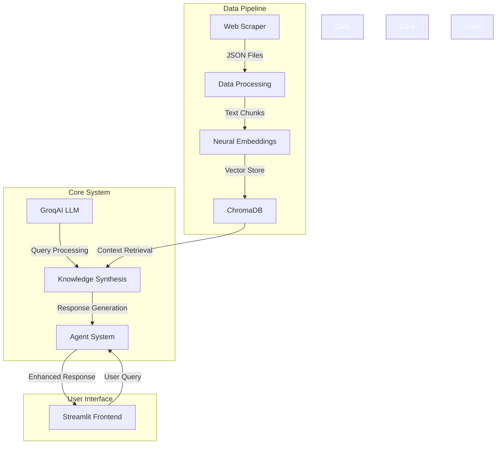
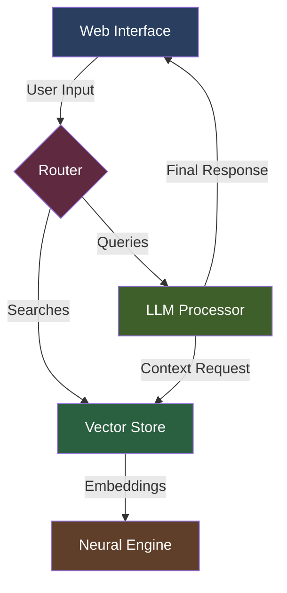
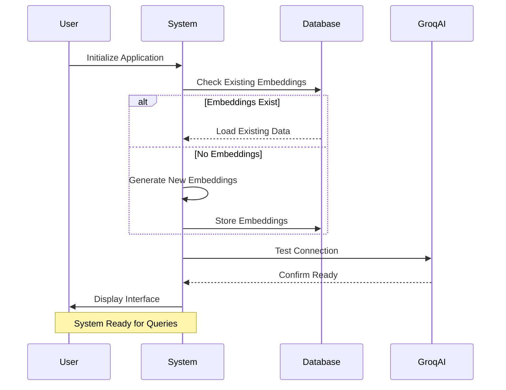
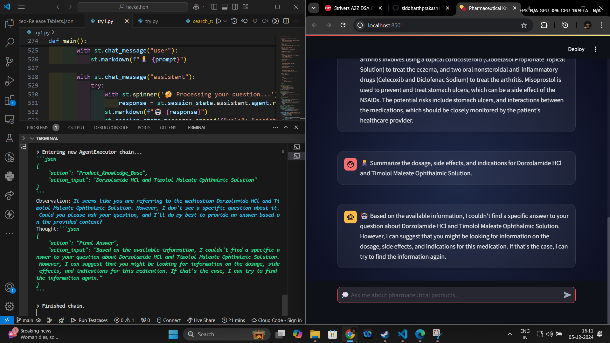

# NeuroPharmaQuantix Omniscient Architecture with Recursive Knowledge Synthesis v2.7.3-Helios

<p align="center">
  <strong>🧬 Advanced Pharmaceutical Knowledge Assistant powered by Neural Embeddings and GroqAI 🤖</strong>
</p>

<p align="center">
  
  
  
  
</p>

## 🌟 Overview

NPQ-OARKS is a sophisticated pharmaceutical knowledge assistant that leverages neural embeddings and large language models to provide accurate, context-aware information about pharmaceutical products. Built using state-of-the-art technologies, it offers an intuitive chat interface for accessing detailed pharmaceutical knowledge.

## 🏗️ Architecture



## ✨ Features

- **Advanced Neural Processing**: Utilizes HuggingFace's all-MiniLM-L6-v2 for state-of-the-art text embeddings
- **Intelligent Context Synthesis**: Implements recursive character splitting for optimal text processing
- **GPU-Accelerated Performance**: Leverages CUDA acceleration for enhanced processing speed
- **Persistent Knowledge Store**: ChromaDB-based vector storage for efficient information retrieval
- **Interactive UI**: Sleek, animated interface with realtime response visualization
- **Multi-Tool Integration**: 
  - Product Knowledge Base
  - Smart Summarizer
  - Intelligent Recommender

## 🚀 Quick Start

1. **Clone the Repository**
```bash
git clone https://github.com/yourusername/NeuroPharmaQuantix-OARKS.git
cd NeuroPharmaQuantix-OARKS
```

2. **Environment Setup**
```bash
python -m venv env
source env/bin/activate  # On Windows: env\Scripts\activate
pip install -r requirements.txt
```

3. **Configure Environment Variables**
```bash
# Create .env file
GROQ_API_KEY=your_api_key_here
```

4. **Run the Application**
```bash
streamlit run try1.py
```

## 💻 Technical Implementation

### Data Pipeline
- **Web Scraping**: Custom scraper for pharmaceutical data acquisition
- **Text Processing**: RecursiveCharacterTextSplitter with 500-token chunks
- **Embedding Generation**: GPU-optimized batch processing
- **Vector Storage**: Persistent ChromaDB implementation

### Core Components
```python
# Key System Components
├── ChatGroqManager        # LLM Interface Management
├── PharmaKnowledgeAssistant
│   ├── Embeddings Engine
│   ├── Vector Store
│   ├── Tools System
│   └── Agent Framework
└── UI System
```

## 🛠️ Development Stack

- **Frontend**: Streamlit with custom CSS animations
- **Backend**: Python with LangChain framework
- **Database**: ChromaDB for vector storage
- **AI Models**: 
  - GroqAI llama-3.2-90b-vision-preview
  - HuggingFace all-MiniLM-L6-v2

## 🎯 Performance Optimization

- Batch processing for embedding generation
- CUDA acceleration for GPU systems
- Efficient memory management with periodic cache clearing
- Optimized chunk size for context retrieval

## 🎨 UI/UX Features

- Dark mode interface with radial gradient
- Animated message transitions
- Interactive chat bubbles
- Real-time response indicators
- Custom scrollbar implementation
- Responsive design elements

## 📊 System Architecture Components



## 🔄 Setup Process Flow




## 🤝 Contributing

Contributions are welcome! Please feel free to submit a Pull Request.

## 🙏 Acknowledgments

- MicroLabs USA for pharmaceutical data
- Groq team for AI infrastructure
- LangChain community for framework support

📸 Demo Screenshot
<p align="center">
  
</p>
🔑 Important Notes for Users
Environment Setup
Before running the application, make sure to:

Create a .env file in the root directory with your API keys:

bashCopyGROQ_API_KEY=your_groq_api_key_here
Dataset Options
Using Medical Dataset (Default)

Download the pharmaceutical dataset:

Create a datasets folder in the root directory
Inside it, create a microlabs_usa folder
Run web_scrapper.py to populate the data
Let the embeddings generate on first run


Using Custom Dataset
You can adapt this architecture for any domain! Simply:

Prepare your data in JSON format with a similar structure
Update the data loading path in try1.py
Adjust the tool descriptions and prompts for your domain
Let the system generate new embeddings for your data

The architecture is domain-agnostic and can be used for:

Legal document analysis
Educational content delivery
Technical documentation
Customer support
and much more!

